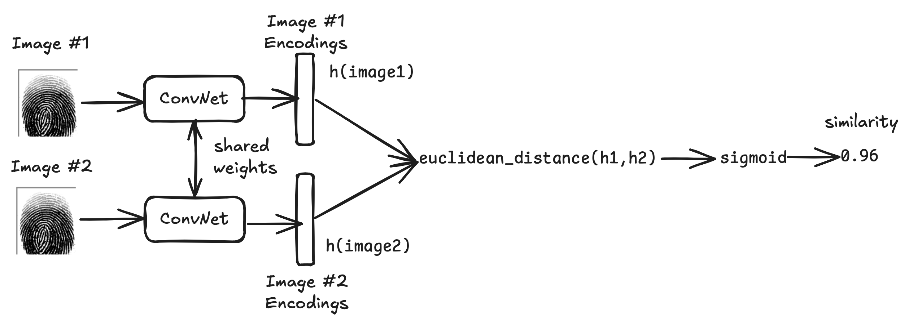
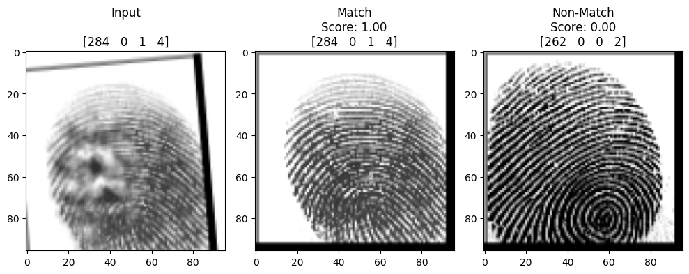
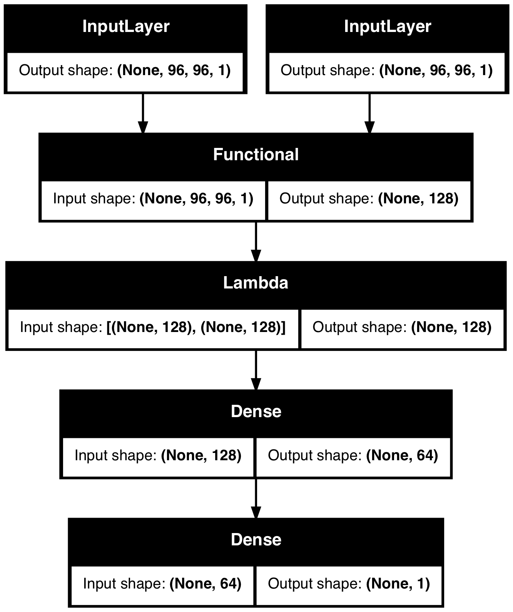

# Fingerprint Recognition using CNN and Keras

Fingerprint recognition tasks typically fall into one of two categories:

- **Fingerprint Verification (1:1 matching)** — *"Is this the claimed person?"*  
  A one-to-one comparison between a captured fingerprint and a stored template.  
  **Example:** Unlocking a smartphone using your fingerprint.

- **Fingerprint Identification (1:K matching)** — *"Who is this person?"*  
  A one-to-many comparison that matches a fingerprint against a database of enrolled fingerprints.  
  **Example:** Allowing employees to enter a building without ID cards, just by scanning their finger.

---

This project focuses on **Fingerprint Verification** using a **Siamese Neural Network** built with **Keras** and **TensorFlow**, trained on the [SOCOFing dataset](https://www.kaggle.com/datasets/ruizgara/socofing). The network learns to determine whether two fingerprint images belong to the same identity.

---

## Project Structure

- `fingerprint_recognition.ipynb`: Main notebook containing model training, evaluation, and visualization.
- `preprocess.ipynb`: Secondary notebook containing data preprocessing,.
- `dataset/` (removed): Folder structure expected to contain the raw SOCOFing dataset and processed `.npy` files.
- `model.png`: Diagram of the trained model architecture (generated with `keras.utils.plot_model`).
- `README.md`: Project description and instructions.

---

## Approach

We use a **Siamese architecture** that learns to map fingerprint images into an embedding space. Given a pair of images, the network predicts their similarity based on the **L1 distance** between their embeddings.


<caption><center> <u> <b>Figure 1: Siamese Network</b> </u></center></caption>

To make the system more robust, the notebook includes:
- Data preprocessing and label parsing
- Image augmentation using `imgaug`
- A custom Keras `DataGenerator` that feeds positive (matching) and negative (non-matching) fingerprint pairs during training
- Model architecture with shared convolutional layers
- Evaluation through real vs. synthetic fingerprint comparison

---

## Requirements

Make sure you have the following packages installed:

```bash
pip install numpy<2.0 matplotlib keras tensorflow==2.16.2 imgaug scikit-learn
````

**Note:** TensorFlow 2.16.2 requires `numpy<2.0`. If you encounter compatibility issues, downgrade NumPy using:

```bash
pip install numpy==1.24.4
```

---

## Dataset

This project uses the [SOCOFing Dataset](https://www.kaggle.com/datasets/ruizgara/socofing), which contains:

* 6,000 real fingerprint images
* 49,200 synthetically altered versions (easy, medium, hard difficulty)
* Metadata such as subject ID, gender, finger type, and side (left/right)

---

## Result

The notebook evaluates the model by:

* Displaying original vs. augmented fingerprint samples
* Comparing a query fingerprint against both matched and unmatched samples
* Predicting similarity scores in real time



Let’s assume the **left image** is a new fingerprint input from a user, while the **center** and **right images** are stored in a database.

Each title label (e.g. `[122 0 0 1]`) corresponds to:

- `subject_id`  
- `gender`: `0` for male, `1` for female  
- `hand`: `0` for left, `1` for right  
- `finger`: `0` to `4` (thumb to little)

To simulate real-world noise, we apply augmentations such as **Gaussian blur**, **zoom**, **translation**, and **rotation** to the input image.  
In the example above:
- The **center image** matches the query and returns **99% similarity**.
- The **right image** is a mismatch, with the model confidently assigning it a **0% match**.

---

## Model Architecture

The following Siamese network architecture is used to extract fingerprint embeddings and compare their similarity:



The network uses shared convolutional layers to produce embeddings for two input images, computes their L1 distance, and classifies them as a match or not using fully connected layers.

---

## References

Some of the ideas and code structure in this notebook were adapted or inspired by the following resources:

* [Kairess' Fingerprint Recognition GitHub Repository](https://github.com/kairess/fingerprint_recognition)
* Koch et al. (2015), *"Siamese Neural Networks for One-shot Image Recognition"*
* [SOCOFing Dataset on Kaggle](https://www.kaggle.com/datasets/ruizgara/socofing)
* [Keras Siamese Triplet Loss Example](https://keras.io/examples/vision/siamese_network/) by Hazem Essam and Santiago L. Valdarrama
